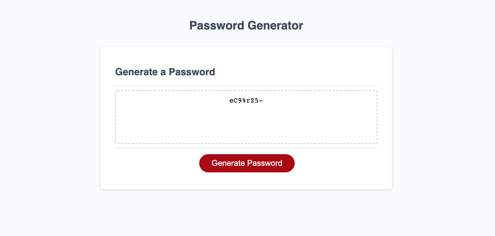

# Password Generator

password generator

This assignment was to build a random password generator. The code in HTML and CSS was already written and some starter JS code was provided. Using prompts the generator is supposed to ask the user four questions.

1.  How many characters, between 8 - 128, are to be included,
2.  if lower case letters were to be included,
3.  if upper case letters were to be included,
4.  if numbers were to be included, and
5.  if special characters were to be included.

In my assignment, all of the desired characters are pulled from the ASCII character table. Through prompts and confirms, the users responses are stored. Using a for loop, js pulls the needed number and type of characters. The js file looks to the html file for when to begin generating the password and where to display it once it is created.

https://michelleberta.github.io/password-generator/

